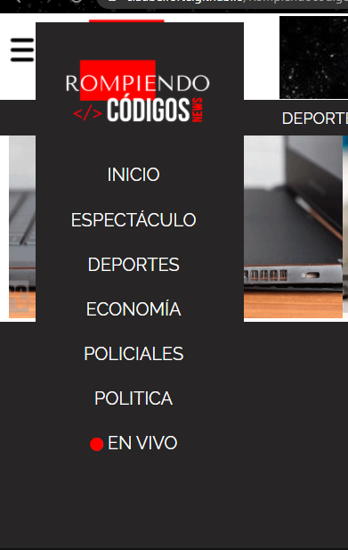
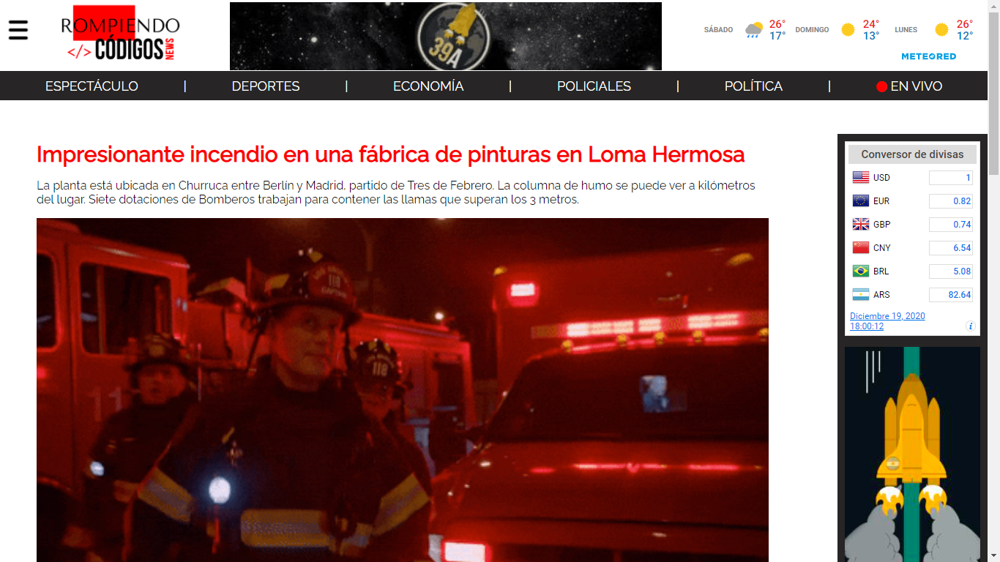
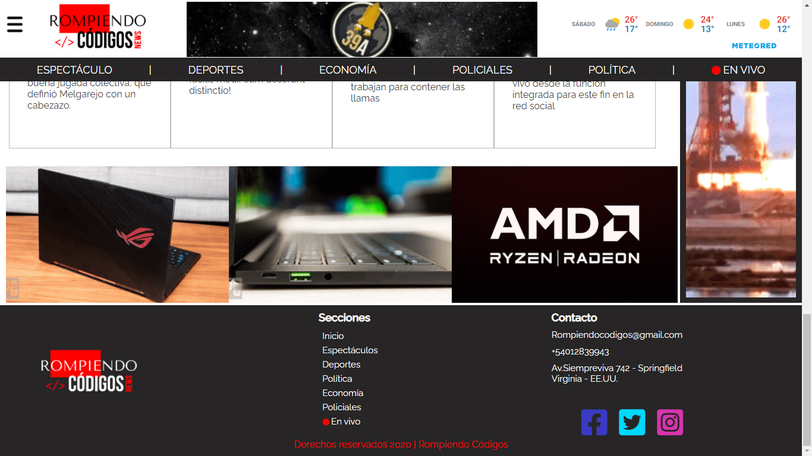
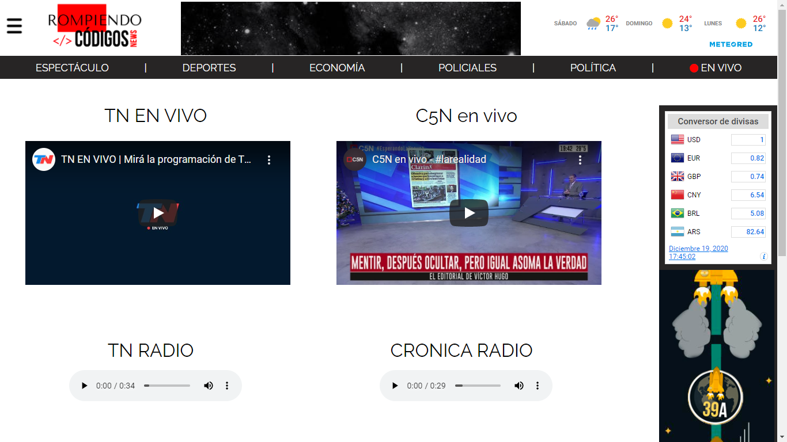

<!DOCTYPE html>
<html>
    <body>
    <header>
                                                                          
    </header>

    <h4>Este proyecto es para nuestra academia Plataforma 39A.</h4>
        
Es una práctica grupal y consiste en la creación de un diario-digital en que debíamos incluir gifs, videos, publicidades, nuestro propio logo, secciones y noticias reales desplegadas. 
 
    <h4>Tecnologías que podemos utilizar para realizarlo</h4>
    <ul>
        <li><b>HTML</b></li>
        <li><b>CSS</b></li>
        <li><b>GIT</b></li>
        <li><b>Algunos widgets</b></li>
    </ul>
     
    <b> Desarrolladores que trabajaron en esta página:</b>
        <a href="https://github.com/matimza">
<b>Matias Mendoza</b>
</a>
    <a href="https://github.com/Priscilla-Rojas">
<b>Priscilla Rojas</b>
</a>
    <a href="https://github.com/ClauBelforte">
<b>Claudia Belforte</b>
</a>
    <a href="https://github.com/nicocrespi00">
<b>Nicolas Crespi</b>
</a>
    <a href="https://github.com/Fr4nee">
<b>Franco Romano</b>
</a>
    <a href="https://github.com/jorlean">
<b>Jorge Borges</b>
</a>
    <a href="https://github.com/FacundoCarollo">
<b>Facundo Carollo</b>
</a>
  

   
 <b>Nuestro diario digital:</b>

   

    Queríamos tener una visión minimalista , prolija y limpia, que permita al lector obetener la información clara y detallada de la noticia que está leyendo. 
    Los colores elegidos son rojo, negro , blanco y gris. 
    Tenemos un menú desplegable con el que podemos transportarnos a cualquier sección.

    
    
Cada sección se compone de un aside con publicidad y un conversor de divisas, un header con un widget del clima, el logo y el título de la sección o una publicidad de Plataforma 39A.

    
    
Contiene un footer con nuestros datos, otro menú y redes sociales.

    
    
Y por último tenemos una sección En Vivo en la que encontramos enlaces a transmisiones en vivo de principales canales de noticias. 

    

    Fue hecha con mucha dedicación por el equipo Rompiendo Códigos, estudiantes de Plataforma 39A , agradecemos a nuesro mentor Gabriel por los conocimientos y el tiempo brindado.

</body>

</html>
